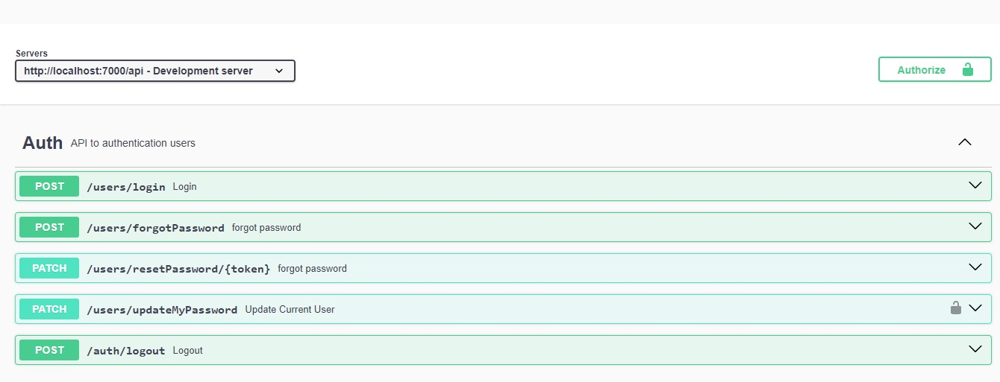
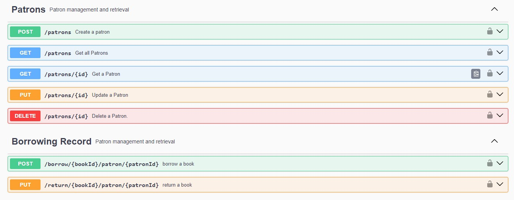
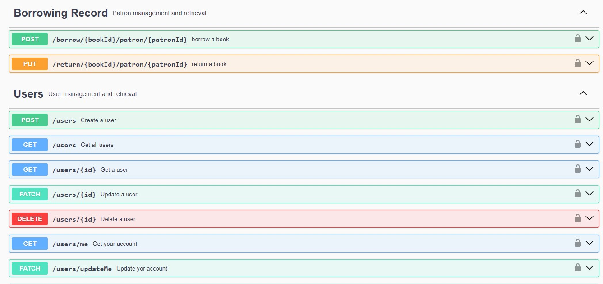

# Library Managemen

## The goal of this project is to solve a task and nothing more


## User Table

The User table stores information about the users of the system. It includes attributes such as user ID, username, email, password, role, and any additional user details.

## Authentication

The project implements authentication functionality to verify the identity of users. It includes features such as user registration, login, and logout. Authentication is implemented using techniques like password hashing and token-based authentication.

## Authorization

The licensing functionality allows the system to manage licenses for users or entities. It includes features such as license generation, validation, and expiration. The project may utilize license keys, digital signatures, or other mechanisms to enforce licensing rules.

## Security

The protection aspect focuses on securing the application and its resources. It involves implementing security measures such as user roles and permissions, access control, and data encryption. It aims to prevent unauthorized access, ensure data confidentiality, and protect against common security vulnerabilities.

### Explanation of Security Measures in the Code

The provided code snippet is a part of a web application written in JavaScript using the Express framework. The application includes several security measures to enhance the security and protection of the application. Here's an explanation of each measure:

### CORS (Cross-Origin Resource Sharing)

The code uses the "cors" library to implement Cross-Origin Resource Sharing (CORS). CORS allows other websites to make requests to this web application. The allowed origins are specified, and the server responds with the appropriate "Access-Control-Allow-Origin" header to indicate which origins are allowed to access the resources.

### Helmet

The "helmet" library is used to set secure HTTP headers. It helps protect the application from common web vulnerabilities such as Cross-Site Scripting (XSS), clickjacking, and MIME-sniffing attacks. Helmet automatically adds various security-related headers to the server's responses.

### Rate Limiting

The code utilizes the "express-rate-limit" library to implement rate limiting. It sets a maximum limit on the number of requests allowed from the same IP address within a specified time period. This prevents abuse and helps protect the server from DDoS attacks and brute-force attacks.

### Data Sanitization

To enhance security, the code uses the "express-mongo-sanitize" library for data sanitization. "express-mongo-sanitize" prevents NoSQL query injection by removing any characters that could alter the query's logic and structure. This helps protect the application from malicious queries and potential data breaches.

### XSS Protection

The "xss-clean" library is used for cross-site scripting (XSS) protection. It sanitizes user input by removing any malicious HTML tags and scripts. This prevents attackers from injecting harmful code into the application and protects users from potential XSS attacks.

### Compression

The "compression" library is used to enable gzip compression of the server's responses. This reduces the size of the transferred data and improves the application's performance by reducing network latency.

## Error Handling

The project includes robust error handling mechanisms to gracefully handle and report errors. It implements error logging and provides informative error messages to aid in debugging and troubleshooting. The application may handle errors using try-catch blocks, error middleware, or error-handling frameworks.

## Database Seed

- create an admin user in the database by --> node seeds.js

## Install

Some basic Git commands are:

```
$ git clone https://github.com/MahamdSirafi/user-Authentication-Authorization.git
$ cd user-Authentication-Authorization
$ npm install
```

## Start development

```
$ npm start
```

## Languages & tools

- [Node](https://nodejs.org/en/)

- [Express](https://expressjs.com/)

- [Mongoose](https://mongoosejs.com/)

## API Endpoints

### user Endpoints

Please refer to the API documentation by swagger for more details on request and response formats.
like ....









## Setting Up .env File

This guide explains how to set up an `.env` file to configure environment variables.

### Steps

1. Create a new file and name it `.env` in your project directory.

2. Open the `.env` file using any text editor.

3. Add the environment variables and their values to the file. Write each variable on a separate line in the following format:

Here are some examples:

NODE_ENV=development

PORT=7000

DATABASE_LOCAL=mongodb://127.0.0.1:27017/DatabaseName

JWT_SECRET=asjdhgjed2187yhdkjawh

JWT_EXPIRES_IN=90d

JWT_COOKIE_EXPIRES_IN=90

SERVICE_EMIL=Sendgrid

EMAIL_HOST=sandbox.smtp.mailtrap.io

EMAIL_PORT=222

EMAIL_USERNAME=sjhajd

EMAIL_PASSWORD=askbhfajs

EMAIL_FROM=test@gmail.com

GMAIL_USERNAME=

GMAIL_PASSWORD=

SENDGRID_USERNAME=

SENDGRID_PASSWORD=

## Technologies Used

- Node.js: JavaScript runtime environment
- Express.js: Web application framework for Node.js
- JSON Web Tokens (JWT): Token-based authentication mechanism
- MongoDB: NoSQL database for data storage

## License

This project is licensed under the [MIT License](LICENSE).

Feel free to modify the code according to your specific project requirements.